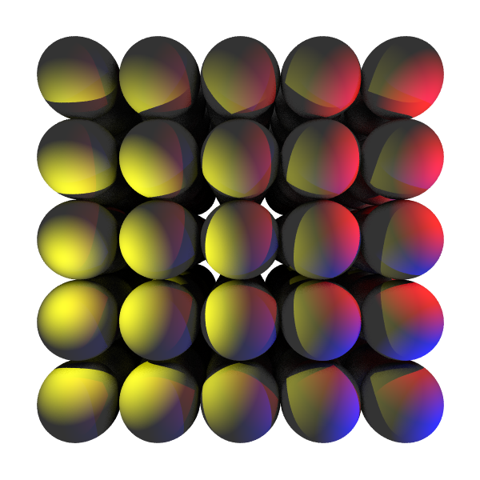
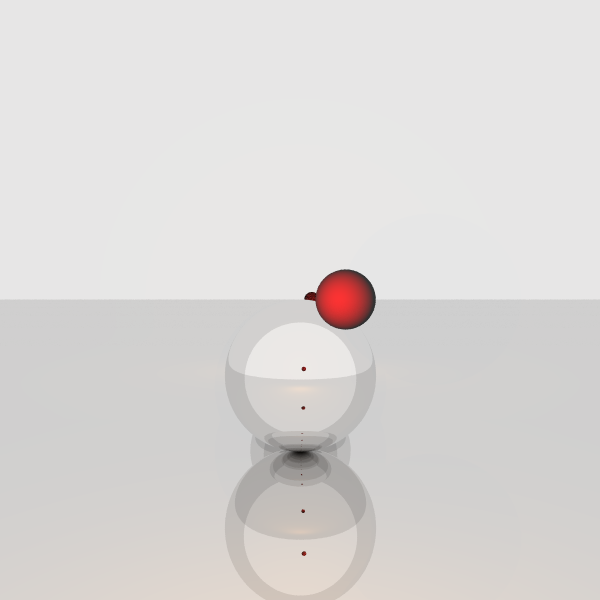

# Raytracer
Questa Repository contiene il mio progetto per il corso di GPU Computing all'università statale di Milano.   
Ho sviluppato un raytracer in due versioni: una completamente sequenziale e una che usa il modello di calcolo CUDA.    

## Immagini Generate
Qui di seguito alcune immagini generate:
git 

   

