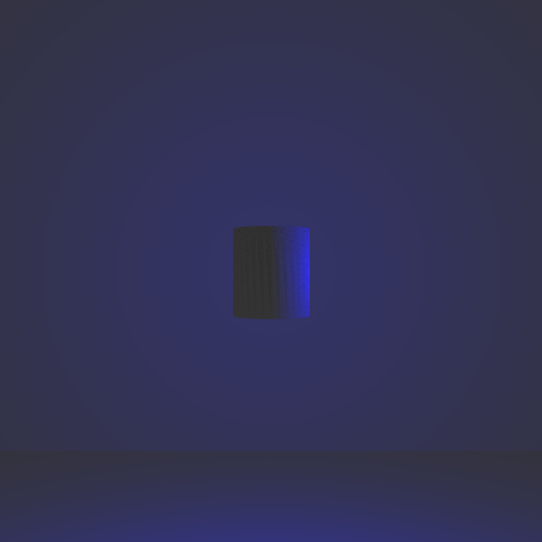
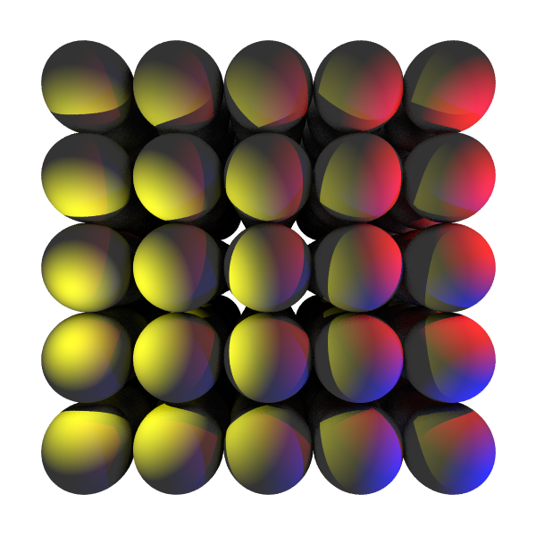

\tableofcontents

# Introduzione
  Lo scopo di questo progetto è di implementare un raytracer usando il modello di calcolo CUDA.
  Un raytracer è un programma che genera un immagine calcolando il colore del singolo pixel basandosi sul percorso fatto dalla luce.
  Ogni singolo pixel dell'immagine viene calcolato indipendentemente dagli altri, questo rende il problema ottimo per essere parallelizzato.

# Descrizione dell'algoritmo
  L'algoritmo di raytracing simula il comportamento della luce, calcolando il percorso fatto dal singolo fotone a contatto con le superfici.
  La mia implementazione dell'algoritmo legge i parametri della scena da un file di testo e esporta un'immagine in formato bitmap.
  La scena può contenere
     - dei punti luce di ogni colore e raggio,
     - geometrie primitive, quali sfere e piani
     - mesh
  Il formato del file di testo è descritto in ... formato della scena.
  
  
## Ray Tracing
   Per ogni pixel dell'immagine l'algoritmo simula il percorso del fotone tracciando un raggio nella scena.
   Ogni volta che il raggio viene tracciato nella scena si calcola quale è l'oggetto più vicino con cui collide e in che punto.
   Il colore del pixel viene calcolato sommando due componenti: componente diffusiva e la componente riflessiva.
   
   La componente diffusiva è determinata dal colore del materiale dell'oggetto colpito e dalle fonti di luci.
   **TODO: riguardare**   
   Le fonti di luce che raggiungono quel punto e non sono occluse da altri oggetti vengono sommate alla componente diffusiva. 
   Prima di essere sommate ne viene calcolata l'attenuazione dovuta dalla distanza tra la sorgente e il punto, l'attenuazione è quadratica rispetto alla distanza.
   L'intensità della luce provieniente dal punto è dovuta anche alla tangenza della direzione della luce rispetto all'oggetto. Questo fattore viene calcolato con il prodotto vettoriale della normale dell'oggetto (n) e la direzione della luce (u).

   \begin{equation}
      n . u * (1 / d ^ 2)
   \end{equation}

   La componente riflessiva viene calcolata ricorsivamente tracciando un altro raggio nella scena, essa simula il rimbalzo del fotone sull'oggetto.
   La direzione del rimbalzo dipende dalla normale dell'oggetto colpito nel punto e dal tipo di materiale.
   Ho implementato due tipi di materiale: plastico e metallico.
   Il materiale plastico rappresenta un tipo di riflessione quasi totalmente diffussivo, in questo caso la luce viene riflessa in più direzioni.

   Il materiale metallico invece riflette la luce in un solo angolo, specchiando la direzione della luce rispetto alla normale.
   
   **TODO: wikipedia images**

   
## Formato della scena
Per descrivere gli oggetti nella scena ho usato un semplice formato testuale.
La prima linea del file è l'intestazione e specifica le dimensioni dell'immagine:   
```
size 600 600
```

Per descrivere un punto luce    
```
light (0, 0, 0) red  
```

dove `(0, 0, 0)` è la posizione composta da tre numeri decimali, e `red` è il colore che si può anche descrivere come vettore rgb (`(1, 0, 0)` in questo caso).    

Per aggiungere le geometrie di base:
```
sphere (-2.5, -2.5, -10) .5 white
```

Dopo la direttiva `sphere` segue la posizione all'interno della scena, poi il suo raggio e infine il colore del materiale se non diversamente specificato il materiale è plastico, per specificare un materiale metallico si può scrivere `metal:colore`

Per descrivere i piani, basta specificare `plane` il suo centro, seguita della normale del piano e infine la descrizione del materiale 
es.   
```
plane (-7, 0, -4) (1, 0, 0) metal:white
```

Infine per caricare modelli all'interno della scena si può usare la direttiva `model` seguita dal percorso del file obj.
```
model "stanford_bunny.obj"
```


# Utilizzo del modello di programmazione CUDA
## Suddivisione dei thread
Per sua natura un algoritmo di raytracing è un problema altamente parallelizzabile: ogni pixel viene calcolato indipendentemente dagli altri. Per questo motivo ho deciso di assegnare un pixel a un thread.   
Per sfruttare al meglio il modello di programmazione CUDA ho deciso di suddividere i thread in blocchi corrispondenti a sezioni di pixel 8x8 questo perchè intuitivamente, raggi vicini tra loro e collideranno più probabilmente con lo stesso oggetto e anche la direzione del loro rimbalzo sarà più simile rispetto ai raggi più distanti.   
Se due raggi collidono con gli stessi oggetti a ogni rimbalzo i loro threads avranno lo stesso percorso di esecuzione, quindi minimizzare il numero di variazioni nelle collisioni nei thread dello stesso blocco significa minimizzare la divergenza.
Questa suddivisione non sempre riesce a beneficiare di questo principio: se si collide con un oggetto con materiale diffusivo, la direzione di rimbalzo viene campionata secondo una distribuzione uniforme.   

## Allocazione della scena
La scena è stata allocata usando la unified memory.
**---- TODO: magari specificare struct scena**     
L'oggetto scena contiene un array di oggetti che rappresentano i solidi nella scena (modelli, sfere, piani) e un array contenente i punti luce.
Dopo il parsing del file calcolo quale è la dimensione della memoria richiesta sia dalla scena che dai suoi elementi, e alloco un area di memoria contigua.
All'inizio dell'area di memoria si trova l'oggetto scena con le dimensioni e i puntatori ai due array.
A seguire è allocato prima l'array di solidi e successivamente i punti luce.
Nel caso particolare di modelli anche i triangoli degli stessi devono essere allocati: tengo conto anche della loro dimensione occupata quando istanzio la unified memory e li posiziono dopo l'array di solidi.   
Gli oggetti vengono allocati tutti in un area di memoria contigua per minimizzare le cache misses.

## Uso di cu_rand per materiale plastico
Per il materiale di tipo diffusivo, la direzione del rimbalzo viene calcolata campionando la semisfera attorno alla normale.
Per il campionamento casuale ho usato la libreria curand, che consente di generare numeri pseudocasuali nel codice device.
Ogni kernel prende come parametro un puntatore (costante, sola lettura) all'oggetto scena, un buffer di memoria contenente tutti i pixel dell'immagine con le sue dimensioni (larghezza e altezza) e un oggetto `curandState`.
l'oggetto curandState viene inizializzato con lo stesso seed su ogni thread ma con offset diverso.

## Classe Vec3
Per implementare tutte le operazioni vettoriali come somma, prodotto, prodotto scalare ecc... ho implementato una classe Vec3 con 3 decimali x, y e z.    
L'implementazione della classe è abbastanza ovvia l'unica nota è che tutti i metodi sono stati decorati con le direttive `__host__` e `__device__`.    
In questo modo questa classe è usabile sia da codice host, sia dalla GPU.    

## Streams (?)

## Pinned Memory
Per migliorare il tempo di trasferimento dei dati dalla GPU alla CPU con l'uso degli stream, e prevenire la sincronizzazione implicita, il buffer di memoria che contiene i valori dell'immagine è stato allocato nella pinned memory.
La pinned memory è una porzione della memoria che non è soggetta alla paginazione da parte del sistema operativo.   
**---- TODO: profilare con e senza pinned memory e linkare la sezione**     


# Performance e confronto con la versione sequenziale

## specifiche tecniche della macchina utilizzata

Non avendo un dispositivo con scheda grafica nvidia per implementare il progetto ho usato la macchina messa a disposizione da google colab: Tesla T4.
Qui segue l'output del comando `nvidia-smi`

```
+-----------------------------------------------------------------------------+
| NVIDIA-SMI 525.105.17   Driver Version: 525.105.17   CUDA Version: 12.0     |
|-------------------------------+----------------------+----------------------+
| GPU  Name        Persistence-M| Bus-Id        Disp.A | Volatile Uncorr. ECC |
| Fan  Temp  Perf  Pwr:Usage/Cap|         Memory-Usage | GPU-Util  Compute M. |
|                               |                      |               MIG M. |
|===============================+======================+======================|
|   0  Tesla T4            Off  | 00000000:00:04.0 Off |                    0 |
| N/A   36C    P8     9W /  70W |      0MiB / 15360MiB |      0%      Default |
|                               |                      |                  N/A |
+-------------------------------+----------------------+----------------------+
                                                                               
+-----------------------------------------------------------------------------+
| Processes:                                                                  |
|  GPU   GI   CI        PID   Type   Process name                  GPU Memory |
|        ID   ID                                                   Usage      |
|=============================================================================|
|  No running processes found                                                 |
+-----------------------------------------------------------------------------+
```

## Esempi di test

Per testare le performance del programma ho creato una serie di scene di esempio.
Di seguito i file descrittivi della scena con le rispettive immagini generate.

**TODO: aggiungere immagini e madaffucking scene codeblock** Conclusioni
```
size 600 600

model "cylinder.obj" white
plane (0, 0, -6.0) (0, 0, 1) white
plane (0, -2, -6.0) (0, 1, 0) white
light (0, 0, -2) blue
```



```
size 1200 1200

sphere (0, 0, -3.0) 1 white

plane (0, 0, -6.0) (0, 0, 1) white

# light sources
light (-2, 0, -3) blue
light (0, -2, -3) red
light (2, 0, -3) green
light (0, 2, -3) yellow
```


```
size 600 600

sphere (-2, -2, -10) .5 white
# qui ho generato un file con un cubo di sfere equidistanti 5x5x5
# ...
sphere (2, 2, -6) .5 white

light (-2.1, -.5, -5) yellow
light (3, 0.6, -5) red
light (3, -2.5, -5) blue
```



Ho confrontato il tempo di esecuzione del programma con una versione naive, che non fa uso del parallelismo messo a disposizione di CUDA. 
Nel tempo profilato sono escluse parti in comune tra le due versioni come la lettura e il parsing di file, o la scrittura del file bitmap. 

| File              | Naive Version | CUDA Version   |
|-------------------|---------------|----------------|
| multisphere       | ...           |  2.599377 s    |
| simple_sphere     | ...           |  0.083770 s    |
| cylinder          | ...           |  0.096983 s    |
| teapot            | ...           |  0.414119 s    |
**TODO: completare tabella**

## Conclusioni
Il problema di raytracing qui presentato beneficia dell'alto grado di parallelismo del modello CUDA, riuscendo a fornire anche uno speedup di 10x in alcuni casi.