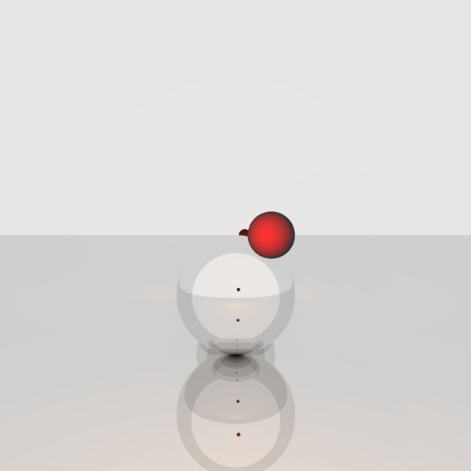
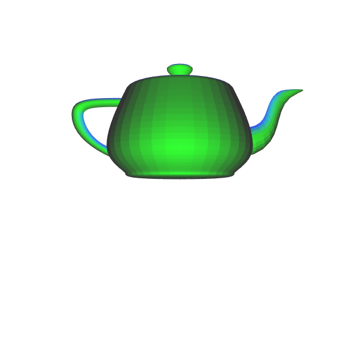

\tableofcontents
\newpage

# Introduzione
  Lo scopo di questo progetto è di implementare un raytracer usando il modello di calcolo CUDA.
  Un raytracer è un programma che genera un immagine calcolando il colore del singolo pixel basandosi sul percorso fatto dalla luce.
  Ogni singolo pixel dell'immagine viene calcolato indipendentemente dagli altri, questo rende il problema ottimo per essere parallelizzato.   
  Nel progetto in esame ho implementato due versioni dell'algoritmo: una con l'utilizzo del modello di programmazione CUDA, ed una puramente sequenziale, per dimostrare i notevoli miglioramenti di performance usando il parallelismo a larga scala messo a disposizione dalle GPU.   
  In questa relazione descriverò prima il funzionamento dell'algoritmo, poi illustrerò alcuni dettagli implementativi e successivamente farò un confronto sui tempi di esecuzione delle due implementazioni.   
  Il sorgente del progetto è disponibile a questo link: [https://github.com/colobrodo/raytracer](https://github.com/colobrodo/raytracer)   

\newpage
# Descrizione dell'algoritmo
  L'algoritmo di raytracing simula il comportamento della luce, calcolando il percorso fatto da ogni singolo fotone.   
  La mia implementazione dell'algoritmo legge i parametri della scena da un file di testo e li esporta un'immagine in formato bitmap.   
  La scena può contenere   
     - dei punti luce di ogni colore e raggio,   
     - geometrie primitive, quali sfere e piani   
     - mesh   
  Il formato del file di testo è descritto in ["formato della scena"](#formato-della-scena).
  
  
## Ray Tracing
   Per ogni pixel dell'immagine l'algoritmo simula il percorso del fotone tracciando un raggio nella scena.   
   Ogni raggio ha un punto di origine e una direzione.   
   Il primo corrisponde alla posizione della camera, il punto in cui si trova virtualmente il nostro osservatore.   
   Per calcolare la direzione viene costruito un rettangolo nella scena, *viewport*.    
   Ad ogni pixel nell'immagine corrisponde un punto nel rettangolo che viene calcolato proporzionalmente.   
   La direzione del raggio viene calcolata come la differenza tra la camera e il punto corrispondente nel *viewport*.   
   Ogni volta che il raggio viene tracciato nella scena si calcola quale è l'oggetto più vicino con cui collide e in che punto.   


   \begin{figure}[!ht]
   \centering
   \resizebox{.7\textwidth}{!}{%
   \begin{circuitikz}
   \tikzstyle{every node}=[font=\Large]
   \draw [short] (8.75,12.25) .. controls (8.75,10) and (8.75,10) .. (8.75,7.75);
   \draw [short] (8.75,12.25) .. controls (11,13.5) and (11,13.5) .. (13,14.5);
   \draw [short] (13,14.5) .. controls (13,10.25) and (13,10.25) .. (13,5.75);
   \draw [short] (8.75,7.75) .. controls (11,6.75) and (11,6.75) .. (13,5.75);
   \draw [ fill={rgb,255:red,0; green,0; blue,0} ] (2,10) circle (0.25cm);
   \draw [-Stealth, dashed] (2,10) -- (9.25,12);
   \draw [-Stealth, dashed] (2,10) -- (9.25,11.5);
   \draw [-Stealth, dashed] (2,10) -- (9.25,11);
   \draw [-Stealth, dashed] (2,10) -- (9.25,8);
   \draw [-Stealth, dashed] (2,10) -- (12.25,7);
   \node [font=\Large] at (8.5,13.25) {viewport};
   \node [font=\Large] at (1.5,10.75) {camera};
   \end{circuitikz}
   }%

   \label{fig:my_label}
   \end{figure}

   Il colore del pixel viene calcolato sommando due componenti: componente diffusiva e la componente riflessiva.   
   
   La componente diffusiva è determinata principalmente dal colore del materiale dell'oggetto colpito, ma è influenzata anche dalle fonti di luci che raggiungono il punto colpito e non sono occluse dagli altri oggetti nella scena.
   La luce prodotta dalle fonti viene aggiunta alla componente diffusiva dopo che ne è stata calcolata l'attenuazione dovuta a due fattori:   
      1. La distanza (d) tra la sorgente e il punto, l'attenuazione è quadratica rispetto ad essa.   
      2. La tangenza della direzione della luce rispetto all'oggetto, essa viene calcolata con il prodotto vettoriale della normale dell'oggetto (n) e la direzione della luce (u).   
   Il colore è rappresentato usando un vettore, e viene attenuato moltiplicando a ogni componente (r, g, b) i due fattori appena descritti.    

   \begin{equation}
      \tag{Attenuazione del punto luce}
      light\_color * (\overrightarrow{n} . \overrightarrow{u}) * (1 / d ^ 2)
   \end{equation}

   La componente riflessiva viene calcolata ricorsivamente tracciando un altro raggio nella scena, essa simula il rimbalzo del fotone sull'oggetto.   
   La direzione del rimbalzo dipende dalla normale dell'oggetto colpito in quel punto e dal tipo di materiale.   
      
   Ho implementato due tipi di materiali: plastico e metallico.
   Il primo rappresenta un tipo di riflessione quasi totalmente diffussivo, in questo caso la luce viene riflessa in più direzioni.


   \begin{figure}[!ht]
   \centering
   \resizebox{.5\textwidth}{!}{%
      \begin{circuitikz}
      \tikzstyle{every node}=[font=\LARGE]
      \draw  (2.75,11.25) rectangle (14.5,9.75);
      \draw [ -Stealth] (8.5,11.25) -- (8.5,15);
      \draw [ -Stealth] (4.5,14.75) -- (8.5,11.25);
      \draw [  color={rgb,255:red,255; green,0; blue,0}, -Stealth] (8.5,11.25) -- (10.75,13.25);
      \draw [  color={rgb,255:red,255; green,0; blue,0}, -Stealth] (8.5,11.25) -- (10.75,12.5);
      \draw [  color={rgb,255:red,255; green,0; blue,0}, -Stealth] (8.5,11.25) -- (10.5,11.75);
      \draw [  color={rgb,255:red,255; green,0; blue,0}, -Stealth] (8.5,11.25) -- (7.25,14);
      \draw [  color={rgb,255:red,255; green,0; blue,0}, -Stealth] (8.5,11.25) -- (9,14.25);
      \draw [  color={rgb,255:red,255; green,0; blue,0}, -Stealth] (8.5,11.25) -- (8,14.25);
      \draw [  color={rgb,255:red,255; green,0; blue,0}, -Stealth] (8.5,11.25) -- (6.25,12);
      \draw [  color={rgb,255:red,255; green,0; blue,0}, -Stealth] (8.5,11.25) -- (10,14);
      \end{circuitikz}
   }%

   \label{fig:my_label}
   \end{figure}


   Il materiale metallico invece riflette la luce in un solo angolo, specchiando la direzione della luce rispetto alla normale.
   
   \begin{figure}[!ht]
   \centering 
   \resizebox{.5\textwidth}{!}{%
      \begin{circuitikz}
      \tikzstyle{every node}=[font=\LARGE]
      \draw  (4.5,9.5) rectangle (14.75,8);
      \draw [ -Stealth] (9.5,9.5) -- (9.5,13.75);
      \draw [  color={rgb,255:red,0; green,0; blue,254}, -Stealth] (6,13.5) -- (9.5,9.5);
      \draw [  color={rgb,255:red,0; green,0; blue,255}, line width=0.5pt, -Stealth] (9.5,9.5) -- (13.25,13.5);
      \node [font=\LARGE] at (10,13.25) {n};
      \end{circuitikz}
   }%

   \label{fig:my_label}
   \end{figure}
   
   Per ottenere un'immagine senza errori di noise e con antialiasing, il singolo pixel viene calcolato più volte variando la direzione del raggio di un angolo molto piccolo, in modo da rimanere nell'intorno del pixel.   
   Successivamente per calcolare il colore finale viene effettuata una media di tutti i campionamenti.   
   Questa tecnica si chiama oversampling e il numero di campioni utilizzato nel progetto è 32 per pixel.   
   
   
## Formato della scena
Per descrivere gli oggetti nella scena ho usato un formato testuale.
La prima linea del file è l'intestazione e specifica le dimensioni dell'immagine:   
```
size 600 600
```

Per descrivere un punto luce    
```
light (0, 0, 0) red  
```

dove `(0, 0, 0)` è la posizione composta da tre numeri decimali, e `red` è il colore che si può anche descrivere come vettore rgb (`(1, 0, 0)` in questo caso).    

Per aggiungere sfere:
```
sphere (-2.5, -2.5, -10) .5 white
```

Dopo la direttiva `sphere` segue la posizione all'interno della scena, poi il suo raggio e infine il colore del materiale.   
Se non diversamente specificato il materiale è plastico, per specificare un materiale metallico si può scrivere `metal:colore`

Per descrivere i piani, basta specificare `plane`, poi il suo centro, seguita della normale del piano e infine la descrizione del materiale 
es.   
```
plane (-7, 0, -4) (1, 0, 0) metal:white
```

Infine per caricare modelli all'interno della scena si può usare la direttiva `model` seguita dal percorso del file obj.
```
model "stanford_bunny.obj"
```


# Utilizzo del modello di programmazione CUDA
## Suddivisione dei thread
Per sua natura un algoritmo di raytracing è un problema altamente parallelizzabile:     
ogni pixel viene calcolato indipendentemente dagli altri, per questo motivo ho deciso di assegnare un thread a un pixel.   
Per sfruttare al meglio il modello di programmazione CUDA ho deciso di suddividere i thread in blocchi corrispondenti a sezioni di pixel 8x8 questo perchè intuitivamente, raggi vicini tra loro collideranno più probabilmente con lo stesso oggetto e anche la direzione del loro rimbalzo sarà più simile rispetto ai raggi più distanti.   
Se due raggi collidono con gli stessi oggetti a ogni rimbalzo i loro threads avranno lo stesso percorso di esecuzione, quindi minimizzare il numero di collisioni diverse tra i thread dello stesso blocco significa minimizzare la divergenza.   
Questa suddivisione non sempre riesce a beneficiare di questo principio: se si collide con un oggetto con materiale diffusivo, la direzione di rimbalzo viene campionata secondo una distribuzione uniforme.   
è quindi impossibile prevedere dopo quel rimbalzo se i raggi dei rispettivi thread avranno direzione simile.    
Il thread gestisce anche l'oversampling del pixel calcolando il colore per ogni campione e ottenendo infine una media.   


## Classe Vec3
Per implementare tutte le operazioni vettoriali come somma, prodotto, prodotto scalare ecc... ho sviluppato una classe `Vec3` con 3 decimali `x`, `y` e `z`.    
Tutti i metodi sono stati decorati con le direttive `__host__` e `__device__`.    
In questo modo questa classe è usabile sia da codice host, sia dalla GPU.    
Questa classe è usata sia per rappresentare vettori, punti nello spazio e colori rgb.   

## Allocazione della scena
L'oggetto scena contiene un array di oggetti che rappresentano tutti i solidi presenti (modelli, sfere, piani) e un array contenente i punti luce.  
Per semplicità 1uesti dati sono allocati usando la unified memory.   
Dopo il parsing del file calcolo quale è la dimensione della memoria richiesta sia dalla scena che dai suoi elementi, e alloco un area di memoria contigua.   
All'inizio dell'area di memoria si trova l'oggetto scena che contiene le dimensioni e i puntatori ai due array (solidi e punti luce).   
A seguire è allocato prima l'array di solidi e successivamente quello contenente i punti luce.   
Nel caso particolare di modelli anche i triangoli degli stessi devono essere allocati: tengo conto anche della loro dimensione quando istanzio la unified memory e li posiziono dopo l'array di solidi.      
Gli oggetti sono allocati tutti in un area di memoria contigua per minimizzare le cache misses.   

## Uso di cu_rand per materiale plastico
Nel kernel in oggetto ci sono due casi dove è necessario l'uso di numeri generati in maniera pseudocasuale:   
1. Per il materiale di tipo diffusivo, la direzione del rimbalzo viene calcolata campionando la semisfera attorno alla normale.   
2. Durante l'oversampling, per determinare la variazione in direzione del raggio agli altri sample.

Per il campionamento casuale ho usato la libreria `curand`, che consente di generare numeri pseudocasuali nel codice device.   
Ogni kernel prende come parametro un puntatore (costante, sola lettura) all'oggetto scena, un buffer di memoria contenente tutti i pixel dell'immagine con le sue dimensioni (larghezza e altezza) e un oggetto `curandState`.   
l'oggetto curandState viene inizializzato con lo stesso seed su ogni thread ma con offset diverso.   


# Performance e confronto con la versione sequenziale

## Specifiche tecniche della macchina utilizzata

Non avendo un dispositivo con scheda grafica nvidia per implementare il progetto ho usato la macchina messa a disposizione da Google Colab:   
GPU: Tesla T4   
CPU: Intel Xeon CPU 2.20GHz, 2 vCPUs (virtual CPUs)   
RAM: 13GB.   


## Esempi di test

Per testare le performance del programma ho creato 5 scene di esempio.
Di seguito i file descrittivi della scena con le rispettive immagini generate.


### Simple Sphere

```
size 1200 1200

sphere (0, 0, -3.0) 1 white

plane (0, 0, -6.0) (0, 0, 1) white

# light sources
light (-2, 0, -3) blue
light (0, -2, -3) red
light (2, 0, -3) green
light (0, 2, -3) yellow
```


### Cylinder
```
size 600 600

model "cylinder.obj" white
plane (0, 0, -6.0) (0, 0, 1) white
plane (0, -2, -6.0) (0, 1, 0) white
light (0, 0, -2) blue
```

Il modello di cilindo utilizzato contiene 128 triangoli.


### Multisphere
```
size 600 600

sphere (-2, -2, -10) .5 white
# qui ho generato un file con un cubo di sfere equidistanti 5x5x5
# ...
sphere (2, 2, -6) .5 white

light (-2.1, -.5, -5) yellow
light (3, 0.6, -5) red
light (3, -2.5, -5) blue
```


### Riflessive
```
size 600 600

sphere (0.3, 0, -4.0) .2 red
sphere (0, -1, -8.0) 1 metal:white

plane (0, -2, -6.0) (0, 1, 0) metal:white
plane (0, 0, -10) (0, 0, 1) metal:white

# light sources
light (0, 0, -3) orange
```

   

### Teapot
L'esempio seguente usa un modello di teiera di utah che contiene 6.320 triangoli.
```
size 600 600

model "teapot.obj" white

# light sources
light (0, 1, -2) blue
light (0, 0, -1) green
```


## Risultati
Ho confrontato il tempo di esecuzione del programma con una versione naive, che non fa uso del parallelismo messo a disposizione di CUDA. 
La versione naive è stata compilata con `gcc` con l'opzione `-O2` per ottenere un codice ottimizzato.   
Ho usato invece `nvcc` per compilare l'implementazione CUDA.    
Nel tempo profilato sono escluse parti in comune tra le due versioni come la lettura e il parsing della scena, o la scrittura del file bitmap.    
Tutte le misurazioni sono state prese con 32 campionamenti per pixel e un limite di 50 rimbalzi. 
Ho eseguito ogni esempio 5 volte e ho riportato il tempo medio di esecuzione.

| File              | Naive Version | CUDA Version   |
|-------------------|---------------|----------------|
| simple_sphere     | 4.7000665 s   |  0.083770 s    |
| cylinder          | 7.079212 s    |  0.096983 s    |
| multisphere       | 36.815982 s   |  2.363945 s    |
| riflessive        | 1.687157 s    |  0.040931 s    |
| teapot            | 40.938330 s   |  2.414119 s    |


## Conclusioni
Il problema di raytracing qui presentato beneficia dell'alto grado di parallelismo del modello CUDA, riuscendo a fornire speedup molto elevati,  anche al di sopra del 50x in alcuni casi.
Il grande divario ottenuto tra la due implementazioni è dovuto anche al fatto che la versione naive non usa alcun tipo di parallelizzazione, quando potrebbe beneficiare ampiamente dell'uso di thread o SIMD a livello di istruzione.   
E' possibile implementare diverse ottimizzazioni che possono migliorare sia la versione naive che quella CUDA come ad esempio strutture dati di partizione dello spazio (OctTree, BVH ecc...).   
L'unica accortezza che ho preso in questa direzione è di include un bounding box (AABB) per ogni modello, in modo da non dover controllare ogni triangolo anche quando la mesh si trova distante rispetto al raggio.   
 